# Testing Without Mocks - Visual Guide

Diagrams summarizing James Shore's "Testing Without Mocks" patterns and techniques.

## 1. Pattern Categories Overview

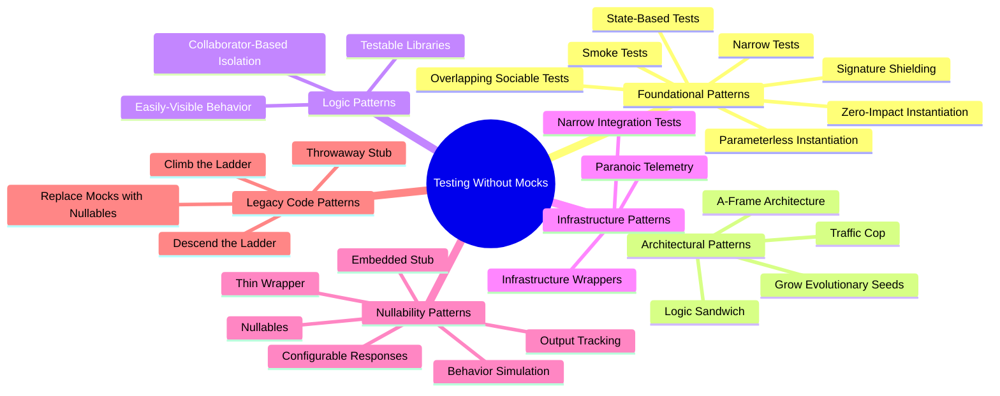

## 2. A-Frame Architecture

The three-layer architecture that separates concerns for testability:

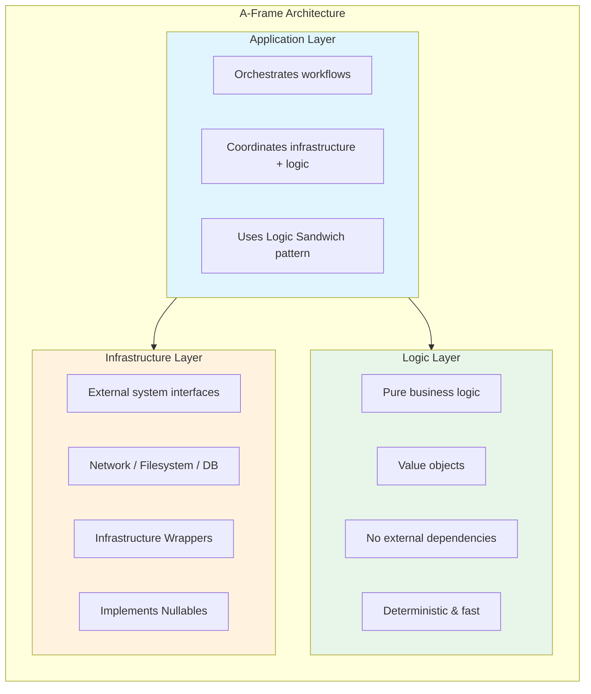

## 3. Logic Sandwich Pattern

Application layer pattern: Read → Process → Write

```mermaid
flowchart LR
    subgraph "Logic Sandwich"
        direction LR
        R["📖 READ<br/>(Infrastructure)"]
        P["⚙️ PROCESS<br/>(Logic)"]
        W["📝 WRITE<br/>(Infrastructure)"]
        
        R --> P --> W
    end
    
    DB1[(Database)] -.-> R
    API1[External API] -.-> R
    W -.-> DB2[(Database)]
    W -.-> API2[External API]
    
    style R fill:#fff3e0
    style P fill:#e8f5e9
    style W fill:#fff3e0
```

## 4. Nullables Pattern

Production code with an "off switch" for testing:

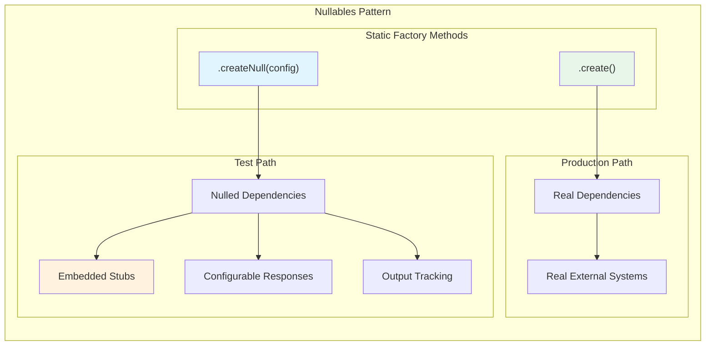

## 5. Infrastructure Wrapper with Embedded Stub

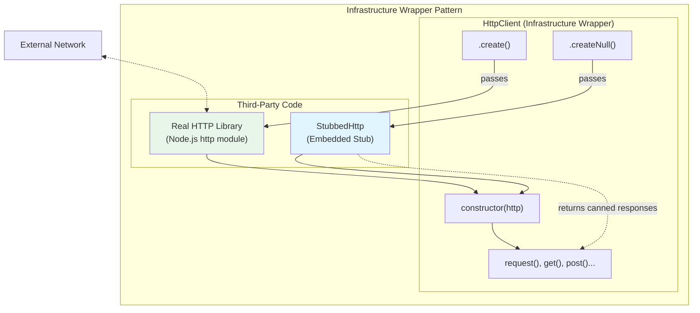

## 6. Configurable Responses

Define responses from behavior perspective, not implementation:

```mermaid
flowchart LR
    subgraph "❌ Wrong: Implementation-Focused"
        W1["HTTP status: 200"]
        W2["JSON body: '{...}'"]
        W3["Headers: {...}"]
    end
    
    subgraph "✅ Right: Behavior-Focused"
        R1["loginSucceeds: true"]
        R2["emailVerified: false"]
        R3["userId: 'abc123'"]
    end
    
    style W1 fill:#ffcdd2
    style W2 fill:#ffcdd2
    style W3 fill:#ffcdd2
    style R1 fill:#c8e6c9
    style R2 fill:#c8e6c9
    style R3 fill:#c8e6c9
```

```mermaid
flowchart TB
    subgraph "createNull with Configurable Responses"
        CALL["LoginClient.createNull({<br/>  email: 'test@example.com',<br/>  emailVerified: false<br/>})"]
        
        DEFAULTS["Sensible Defaults:<br/>• Named parameters<br/>• Optional with defaults<br/>• Tests configure only what matters"]
        
        CALL --> DEFAULTS
    end
```

## 7. Output Tracking

Track behavior (what was written), not function calls:

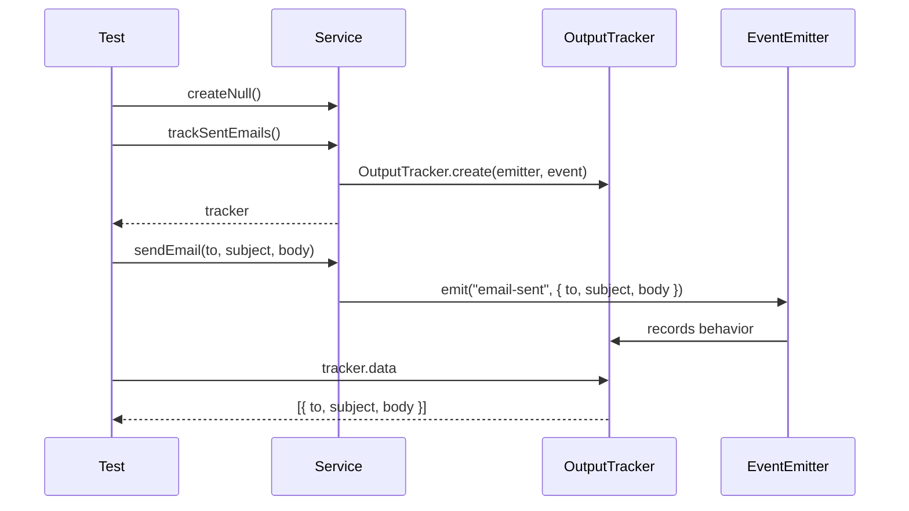

## 8. Testing Strategy

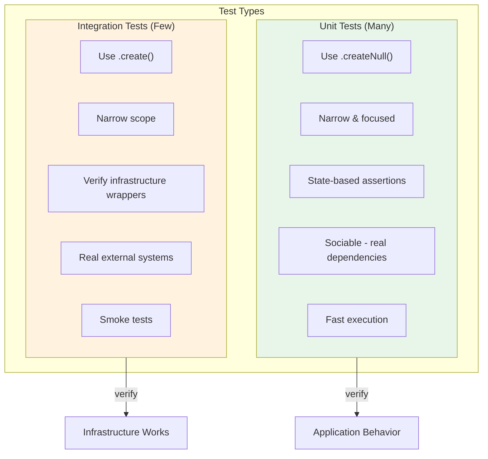

## 9. Test Characteristics Comparison

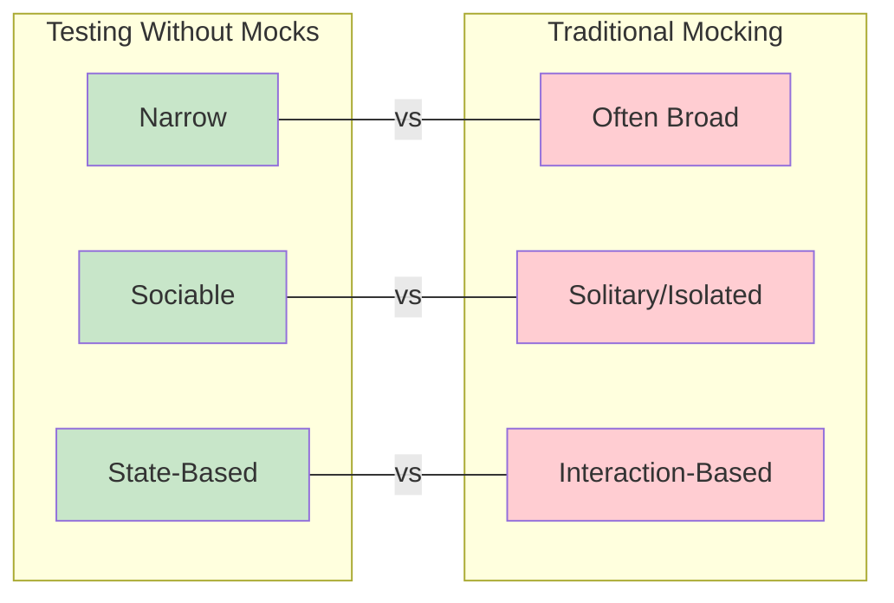

## 10. Naming Conventions

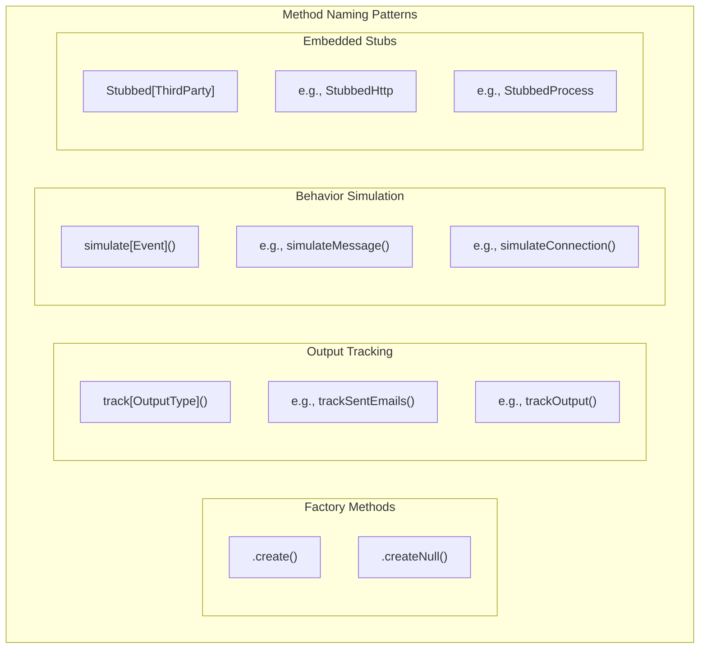

## 11. Legacy Code Migration Path

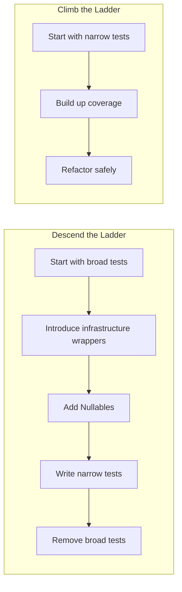

## Quick Reference

| Pattern | Purpose |
|---------|---------|
| **A-Frame** | Separate Application, Logic, Infrastructure layers |
| **Nullables** | Production code with test "off switch" |
| **Embedded Stub** | Stub third-party code, not your code |
| **Configurable Responses** | Test setup via `.createNull({ behavior })` |
| **Output Tracking** | Track what would be written externally |
| **Logic Sandwich** | Read → Process → Write |
| **Narrow Tests** | Focus on specific behavior |
| **Sociable Tests** | Use real dependencies (nulled) |
| **State-Based Tests** | Verify outputs, not interactions |
